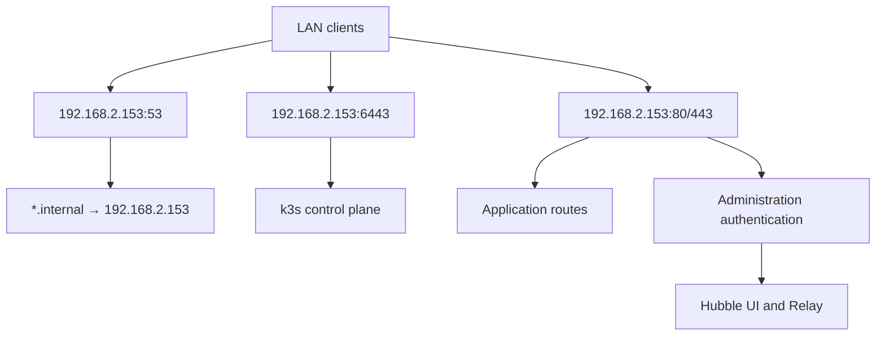

# Design and ownership

The bootstrap node alone has `elektro.internal/edge=true`. Cilium's Gateway API
controller uses host networking on that node and Envoy binds ports 80/443. The
LAN CoreDNS deployment is pinned to the same node, mapping TCP/UDP host port 53
on `api_ip` to unprivileged container port 1053 using Cilium's native HostPort
support. It uses one replica and Recreate updates to avoid competing for the
same host ports. DNS updates/restarts therefore have a short interruption.

The internal DNS Service is a ClusterIP used by cluster CoreDNS, not another
LAN address. No LoadBalancer IP pool, L2 announcement policy, MetalLB, ingress
controller or extra LAN VIP is needed. The only user-facing LAN address comes
from the configuration's `api_ip` key. If `.153` is unavailable, all three entry
points are unavailable; additional control-plane nodes do not change this.

Host scripts own packages, kernel settings, systemd and k3s configuration.
Joining nodes discover their LAN IP at every service start; the bootstrap node
validates its fixed address. Flux owns Kubernetes objects. k3s owns its packaged
CoreDNS and resource metrics-server; Flux supplies the supported
`coredns-custom` extension. Flannel, kube-proxy, k3s network policy, Traefik,
ServiceLB and local storage are disabled. Cilium uses the Node PodCIDRs assigned
by k3s and VXLAN, so the LAN router needs no pod-network routes.

Bootstrap installs Gateway API CRDs before Cilium, then Flux. Cilium uses the
same Helm release name (`cilium`), namespace/storage (`kube-system`) and generated
values during bootstrap and later Flux reconciliation. Flux adopts the existing
release. Bootstrap retries leave Helm management to Flux once its HelmRelease
exists. Both Flux and CRD manifests reference pinned upstream releases.

`clusters/lan/infrastructure.yaml` defines reconciliation dependencies:
Gateway API → Cilium → GatewayClass/DNS; Cilium → cert-manager → PKI;
GatewayClass + PKI → gateway → administration/apps. Cilium has no dependency on
monitoring CRDs. Hubble UI/Relay, mutual TLS between Hubble agents and Relay,
metrics and built-in dashboard definitions come from the Cilium chart. No
collector, dashboard server, alert server or storage operator is deployed.
The optional monitoring examples are outside the reconciliation graph.

Critical CNI, PKI and Gateway API CRD targets disable pruning. Removing those
paths from Git cannot silently uninstall networking or the CA; decommission
them deliberately. Other workload targets prune normally. Bootstrap-created
CA/credential Secrets are outside Flux inventories and need separate backups.

`config.py generate` writes cluster settings, Cilium values, Git source and
pinned remote references. Flux substitutes settings into the other manifests.
`CONFIG_REVISION` rolls DNS and authentication Pods when settings change. Host
settings are not reconciled by Flux. Changing IPs or server flags is a planned
migration, and Pod/Service CIDR changes require rebuilding/migrating the cluster.

HTTPS terminates at Envoy. Separate application/administration listeners use
hostname and namespace selectors. Hubble UI passes through an unprivileged
Nginx authentication proxy. Hubble gRPC and metrics are not routed onto the LAN;
Hubble agent host port 4244 is for trusted cluster peers and should be restricted
by your firewall. This baseline assumes trusted administrators and controlled
workload deployment; it is not a hostile multi-tenant isolation policy.

## Upstream references

- [k3s 1.36 release notes](https://docs.k3s.io/release-notes/v1.36.X)
- [Cilium Kubernetes compatibility](https://docs.cilium.io/en/stable/network/kubernetes/compatibility/)
- [Cilium on k3s](https://docs.cilium.io/en/stable/installation/k3s/)
- [Cilium Gateway API host networking](https://docs.cilium.io/en/stable/network/servicemesh/gateway-api/gateway-api/)
- [Cilium native HostPort support](https://docs.cilium.io/en/stable/network/kubernetes/kubeproxy-free/#container-hostport-support)
- [Cilium/Hubble metrics](https://docs.cilium.io/en/stable/observability/metrics/)
- [k3s runtime discovery and CoreDNS customization](https://docs.k3s.io/advanced)
- [Flux HelmRelease API](https://fluxcd.io/flux/components/helm/helmreleases/)
- [Longhorn host prerequisites](https://longhorn.io/docs/latest/deploy/install/)
- [NVIDIA Container Toolkit installation](https://docs.nvidia.com/datacenter/cloud-native/container-toolkit/latest/install-guide.html)
- [Debian NVIDIA drivers](https://packages.debian.org/trixie/nvidia-driver)
- [Debian Intel firmware](https://packages.debian.org/trixie/firmware-intel-graphics)

The pinned k3s 1.36 release is within Cilium 1.20's documented compatibility
matrix. Review that matrix and Gateway API requirements together when upgrading.
